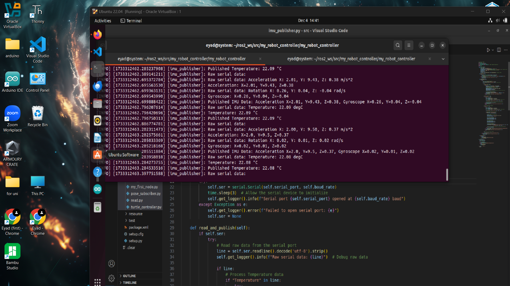
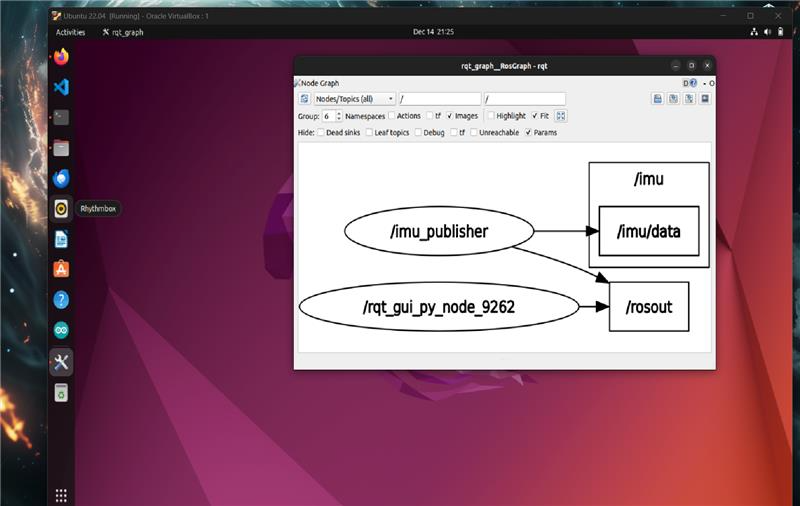

# Underwater Vehicle

This repository provides instructions on how to setup and build the software of the underwater vehicle.

# Operating System

In this case, Linux Ubuntu version 22.04 was used for the development of the vehicle.

# Setup

First step: Your choice of using Ubuntu is really important and you have the following options:

1. Booting Ubuntu on a virtual machine — easier and recommended  
2. Dual booting on your machine — if you have experience with Linux  
3. Using Linux as your main operating system for your machine  

**Note:** In this guide, Ubuntu 22.04.5 LTS is running on a virtual machine.  
Download link: [Ubuntu 22.04.5 LTS](https://releases.ubuntu.com/jammy/ )

# Virtual Machine

You have the following options:

1. VirtualBox  
2. VMware  

**Note:** In this case, VirtualBox is used. You can download it from the following link:  
[VirtualBox Downloads](https://www.virtualbox.org/wiki/Downloads )  
Also, download the Extension Pack as it will be needed later.

# ROS2

The next step after completing Ubuntu setup is installing ROS2.  
For this project ROS2 Humble was used.  
Full guide: [ROS2 Humble Documentation](https://docs.ros.org/en/humble/index.html )

# Code Editor

Having a code editor is important for writing and using open-source projects and libraries.  
**Visual Studio Code** is recommended.

# Arduino IDE

We will have a serial communication via USB between an Arduino board and the Linux machine in order to get the sensors' readings.  
Download link: [Arduino IDE](https://www.arduino.cc/en/software/ )

### Sensors List:
1. IMU (MPU6050)  
2. Pressure Sensor (Bar100)

# IMU

For MPU6050 sensor, you can see this repository:  
[Adafruit MPU6050 GitHub](https://github.com/adafruit/Adafruit_MPU6050 ) 

Install `Adafruit_MPU6050` library, then go to `Adafruit_MPU6050/examples/basic_readings/basic_readings.ino` in Arduino IDE to test the MPU6050 sensor.





# Madgwick Filter

To turn the angular velocities and accelerations from the sensor to a 3D representation, we need to use the Madgwick filter.  
Download link: [imu_tools GitHub](https://github.com/CCNYRoboticsLab/imu_tools )

```bash
ros2 run imu_filter_madgwick imu_filter_madgwick_node --ros-args --param use_mag:=false
```

# Rviz2

<video width="640" height="360" controls>
  <source src="media/Rviz2.mp4" type="video/mp4">
  Your browser does not support the video tag.
</video>

In order to view the IMU readings in 3D, you can use Rviz.  
Download link: [RViz User Guide - ROS2 Humble](https://docs.ros.org/en/humble/Tutorials/Intermediate/RViz/RViz-User-Guide/RViz-User-Guide.html )


# Pressure Sensor

Install BlueRobotics Keller LD Library.  
Product used: [Bar100 Sensor - Blue Robotics](https://bluerobotics.com/store/sensors-cameras/sensors/bar100-sensor-r2-rp/ )  
Example code: [KellerLD_Example.ino](https://github.com/bluerobotics/BlueRobotics_KellerLD_Library/blob/master/examples/KellerLD_Example/KellerLD_Example.ino )

# Controller

Since the vehicle will be moving in all directions, it is recommended to use a joystick controller.  
In this case we are using Xbox controller. This repo is used:  
[teleop_twist_joy GitHub](https://github.com/ros-teleop/teleop_twist_joy )

*It is important to configure the controller like this format in the config file:*

```yaml
teleop_twist_joy_node:
  ros__parameters:
    axis_linear:  # Left thumb stick vertical
      x: 4
      y: 0
      z: 1

    scale_linear:
      x: 0.7
    scale_linear_turbo:
      x: 1.5
      y: 1.5
      z: 1.5

    axis_angular:  # Left thumb stick horizontal
      yaw: 3
    scale_angular:
      yaw: 0.4

    enable_button: 2  # Left trigger button
    enable_turbo_button: 5  # Right trigger button
```

To get the readings:

```bash
ros2 launch teleop_twist_joy teleop-launch.py joy_config:='xbox'
```

# Video Tutorial

- ROS2 tutorials: [ROS2 Playlist - YouTube](https://www.youtube.com/watch?v=0aPbWsyENA8&list=PLLSegLrePWgJudpPUof4-nVFHGkB62Izy)  
- Joystick controller: [Joystick Tutorial - YouTube]( https://www.youtube.com/watch?v=_MVA1fkzRKM&list=PL1YH3iMfizDLgcrTL1rj4NxXYKnPLLkby&index=18)
